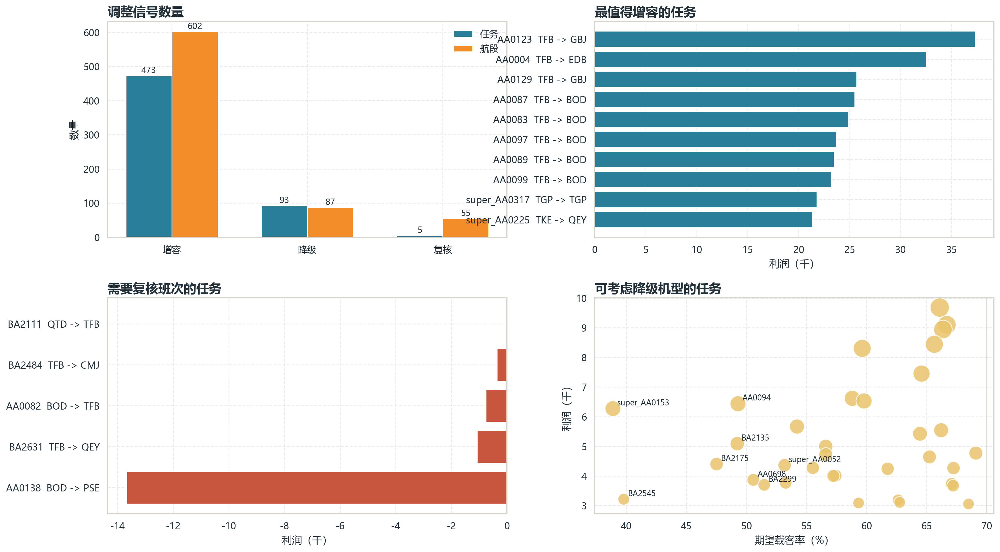
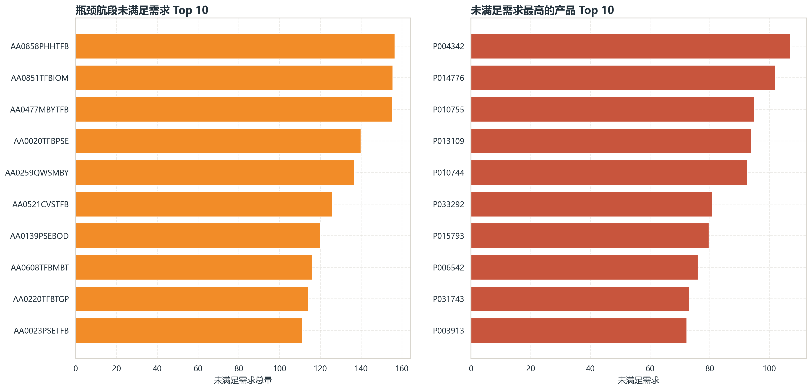

# 问题四图示说明

最后更新：2026-04-23

本文对问题四新增的 5 张可视化图片进行统一说明，便于在报告、答辩或任务书答案中直接引用。

当前正式图片目录：

- [`results/figures/question4`](../results/figures/question4)

该目录当前已经切换为 20 场景 Monte Carlo 图表。原 5 场景图表归档于：

- [`results/figures/question4_5scenario_archive_2026-04-23`](../results/figures/question4_5scenario_archive_2026-04-23)

20 场景详细分析包中的同版图表另存于：

- [`results/analysis/question4_mc20_2026-04-23/figures`](../results/analysis/question4_mc20_2026-04-23/figures)

建议使用方式：

- 如果是正文配图，可以直接使用“图意说明”或“可直接引用的图注”部分。
- 如果是答辩展示，可以优先讲“核心结论”部分，避免陷入细节。

## 1. 机队使用画像

### 图意说明

这张图用于回答“各机型到底是怎么被使用的”。左侧展示不同机型对总利润的贡献，右侧展示各机型的利用率和加权载客率，并用点的大小表示其承载的高影子价格航段数量。

### 怎么看这张图

- 左图条形越长，说明该机型对当前方案利润贡献越大。
- 右图越靠右，说明机型利用率越高。
- 右图越靠上，说明机型承载的平均载运压力越高。
- 右图气泡越大，说明该机型覆盖的瓶颈航段越多，资源越关键。

### 核心结论

- `F16C0Y165` 和 `F0C0Y76` 明显位于“高利用率、高载运压力、高瓶颈承载”的区域，是当前网络的核心主力机型。
- 多个机型几乎没有利润贡献，且在右图中落在左下角，说明它们当前明显闲置。
- 这张图支持的核心判断是：当前问题不是总飞机数量不足，而是少数主力机型偏紧、部分机型没有被有效使用。

### 可直接引用的图注

图 1 展示了当前方案下各机型的利润贡献及使用强度。结果表明，`F16C0Y165` 和 `F0C0Y76` 是网络中的核心主力机型，既贡献了大部分利润，也承担了大部分高影子价格航段；而多类机型处于明显闲置状态，说明当前更像是机型结构错配，而非总运力不足。

## 2. 调整建议总览

### 图意说明

这张图用于回答“下一步调整应该优先做什么”。左上统计了任务和航段层面的调整信号数量，右上展示最值得增容的任务，左下展示最需要复核班次的任务，右下展示一批适合降级机型的候选任务。

### 怎么看这张图

- 左上图反映整体调整方向：增容、降级、复核三类信号分别有多少。
- 右上图中的任务利润越高，说明一旦增容，其潜在收益越值得优先关注。
- 左下图中的任务利润越负，越说明当前班次或时刻安排需要复核。
- 右下图中的点如果载客率偏低但仍占用资源，通常更适合换小机型。

### 核心结论

- 当前最主要的动作不是全面重排，而是定向增容，因为增容信号明显多于降级和复核信号。
- `TFB -> GBJ`、`TFB -> EDB`、`TFB -> BOD` 等任务是最值得优先增容的代表对象。
- 极少数任务虽数量不多，但亏损明显，应该进入班次与时刻复核清单。
- 一批中低载客率任务可以考虑降级机型，从而释放主力机型资源。

### 可直接引用的图注

图 2 汇总了当前方案下的主要调整信号。结果显示，增容或换大机型的任务和航段数量显著高于降级与复核，说明当前优化重点应是对高价值瓶颈任务定向补充容量；同时，对少数低载客率、低收益甚至亏损任务，应考虑降级机型或复核班次安排。

## 3. 瓶颈航段识别

### 图意说明

这张图用于识别“哪些航段是真正值得优先增容的瓶颈”。横轴是影子价格，纵轴是航段收入贡献，点的大小表示该航段关联的产品数量，不同颜色表示不同调整建议。

### 怎么看这张图

- 越靠右，说明影子价格越高，新增一单位容量的边际价值越高。
- 越靠上，说明航段本身的收入贡献越大。
- 点越大，说明该航段影响的产品越多，网络联动价值越高。
- 位于右上区域的点，通常是最应优先增容的航段。

### 核心结论

- 高收入且影子价格显著为正的航段，才是最明确的瓶颈航段。
- `AA0123TFBGBJ`、`AA0004TFBEDB`、`AA0851TFBIOM`、`AA0871IOMBOD` 等航段同时具备高价值与高稀缺性。
- 这张图把“赚钱的航段”和“真正受容量约束的航段”区分开了，因此非常适合支撑增容建议。

### 可直接引用的图注

图 3 从收入贡献和影子价格两个维度识别瓶颈航段。可以看到，若干高收入航段同时具有显著为正的影子价格，说明这些航段既重要又稀缺，是当前网络中最应优先考虑增容或换大机型的关键位置。

## 4. 未满足需求集中位置

### 图意说明

这张图用于回答“未满足需求主要卡在什么地方”。左图按瓶颈航段汇总未满足需求，右图展示未满足需求最高的一批产品，并标注其对应的瓶颈航段。

### 怎么看这张图

- 左图条形越长，说明该航段积压的未满足需求越多。
- 右图条形越长，说明该产品需求缺口越明显。
- 右图每个产品旁边标出的瓶颈航段，可以帮助定位需求到底卡在哪个网络节点。

### 核心结论

- 未满足需求并不是平均分布在全网络，而是集中在少数瓶颈航段上。
- `AA0858PHHTFB`、`AA0020TFBPSE`、`AA0851TFBIOM`、`AA0259QWSMBY` 等航段是未满足需求的重要聚集点。
- 这说明后续调整不应“平均加容量”，而应围绕少数关键瓶颈点做定向优化。

### 可直接引用的图注

图 4 展示了未满足需求在网络中的集中位置。结果表明，需求缺口主要集中在少数瓶颈航段，而不是均匀分散在所有航线中，因此后续航班计划调整更适合采取定向增容策略，而不是平均化扩张。

## 5. 机型使用与性价比

### 图意说明

这张图专门用来解释“为什么有些机型会 0 使用”。横轴是性价比指数，这个指数由每座每小时成本换算得到，越往右说明单位运力成本越有优势；纵轴是利用率，越往上说明该机型在当前方案中的使用强度越高；气泡大小表示归因利润。

### 怎么看这张图

- 越靠右，说明该机型的性价比越高。
- 越靠上，说明该机型在当前结果中被更充分地使用。
- 气泡越大，说明该机型对利润贡献越大。
- 如果某个机型位于“低性价比、低利用率”区域，那么它被闲置往往更像是性价比问题，而不是求解器失误。

### 核心结论

- `F16C0Y165` 和 `F0C0Y76` 落在“高性价比、高利用率”的区域，说明它们既是主力机型，也具备较强成本效率。
- `F8C12Y126`、`F12C0Y132`、`F8C12Y99`、`F12C30Y117` 等机型集中在“低性价比、低利用率”区域，这与其 0 使用结果是一致的。
- 这张图支持的新增发现是：当前闲置机型更可能是因为单位运力成本偏高、性价比较低，而不是因为模型没有找到最优解。

### 可直接引用的图注

图 5 将机型利用率与性价比指数放在同一张图中进行比较。结果显示，当前主力机型主要集中在高性价比、高利用率区域，而若干完全闲置机型则集中在低性价比、低利用率区域。这说明机型未被使用更可能是性价比筛选结果，而非模型求解失败。

## 6. 五张图合起来说明什么

如果把这 5 张图合起来看，可以形成一条完整的分析逻辑：

1. 先用“机队使用画像”说明哪些机型是真正紧张、哪些机型明显闲置。
2. 再用“机型使用与性价比”解释为什么这些闲置现象不必然意味着模型失效。
3. 接着用“调整建议总览”说明当前主要动作应是增容、降级还是复核。
4. 再用“瓶颈航段识别”说明哪些航段值得优先补容量。
5. 最后用“未满足需求集中位置”说明为什么这些航段确实是调整重点。

这套图形共同支持的问题四结论是：

> 当前方案需要进一步调整机队与航班计划，但调整重点应放在少数主力机型和关键瓶颈航段上，核心是结构优化和定向增容，而不是简单扩大总机队规模。
