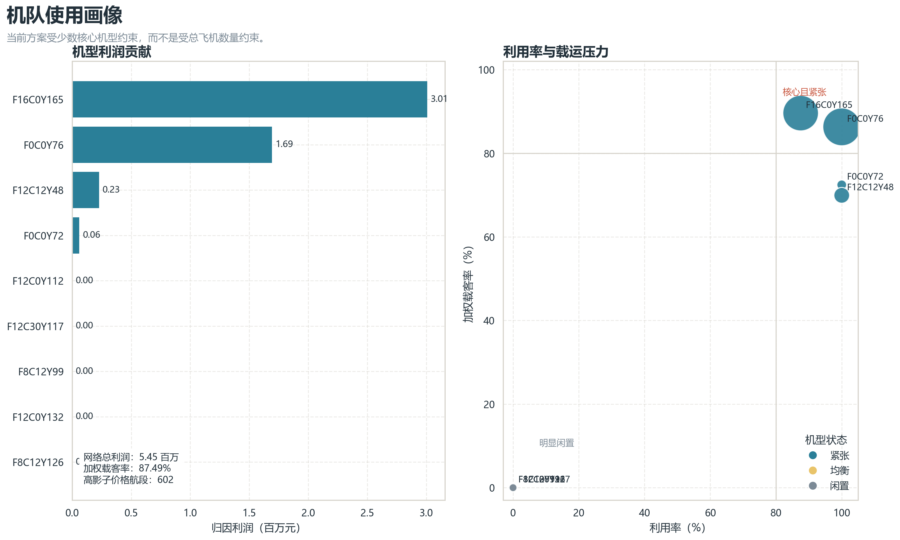
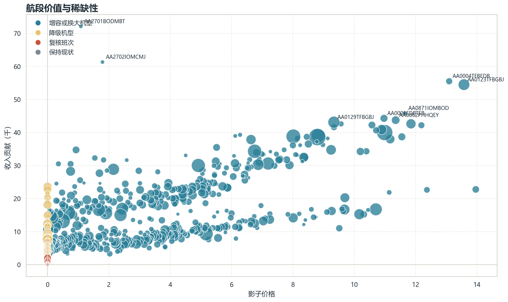
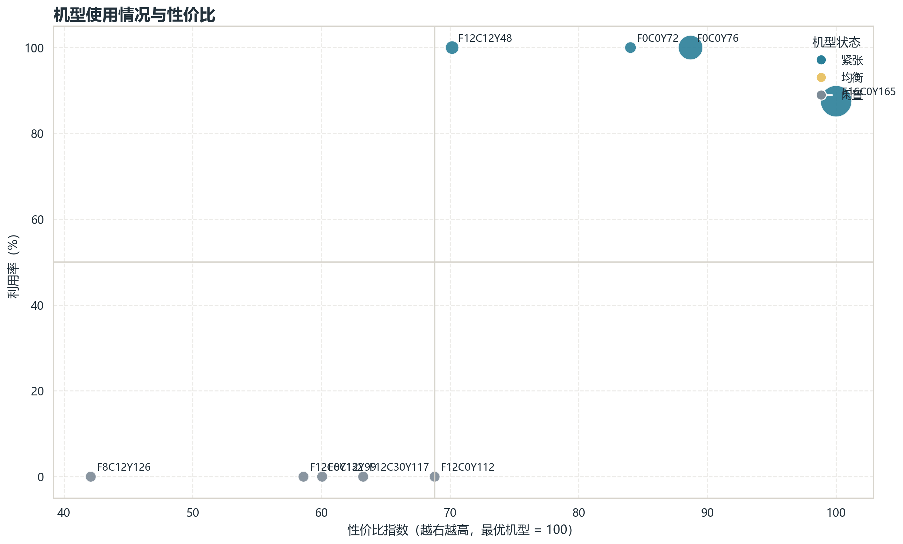

# 第四问图示说明：20 场景 Monte Carlo 主线

最后更新：2026-04-23

本说明对应 `results/analysis/question4_mc20_2026-04-23/figures` 下的 5 张图。图形逻辑沿用原第四问分析，输入结果为当前正式 20 场景 Monte Carlo 主线。

## 1. 机队使用画像

这张图展示各机型利润贡献、利用率、加权载客率和瓶颈承载情况。20 场景下，`F16C0Y165` 与 `F0C0Y76` 仍位于高利用率、高载运压力、高瓶颈承载区域，是网络核心主力机型。

## 2. 调整建议总览

这张图汇总任务和航段层面的增容、降级、复核信号。20 场景下，增容或换大机型仍是最主要信号，说明当前最需要的是定向补容量，而不是全局重排。

## 3. 瓶颈航段识别

这张图从影子价格和收入贡献两个维度识别关键航段。右上区域的航段既赚钱又稀缺，最适合作为后续增容或换大机型的候选对象。

## 4. 未满足需求集中位置

这张图说明未满足需求主要集中在少数瓶颈航段，而不是均匀分布在全网络。该图支撑“围绕瓶颈点定向调整”的建议。

## 5. 机型使用与性价比

这张图解释为什么部分机型会 0 使用。20 场景下，完全闲置机型仍集中在较低性价比或低适配区域，因此闲置更像是成本效率筛选结果，而不是求解异常。

## 6. 合并结论

五张图共同支持的结论是：20 场景结果下，第四问仍应围绕“主力机型紧张、闲置机型不宜盲目扩充、关键瓶颈航段定向增容、低载客率任务降级或复核”展开。
